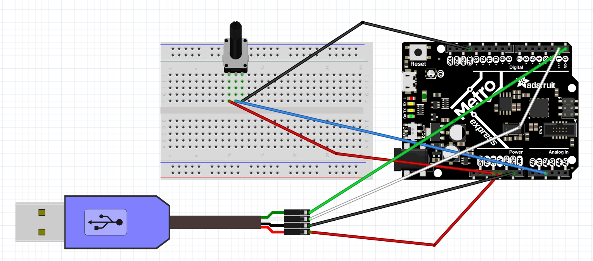
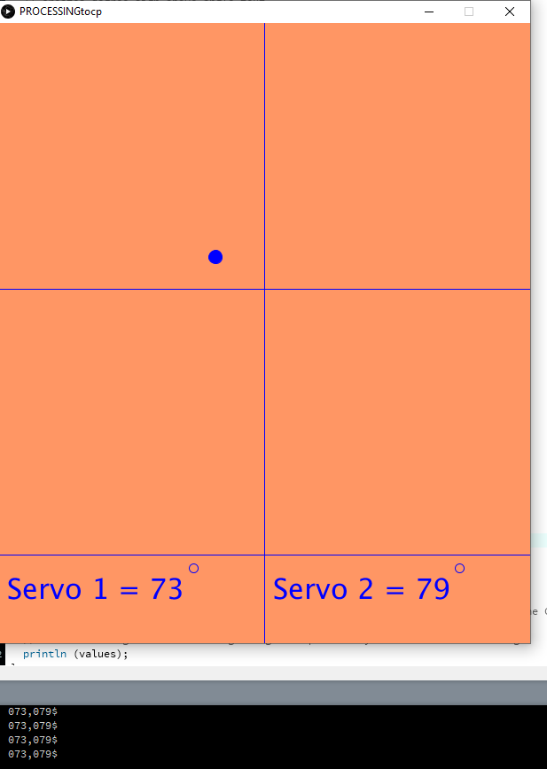
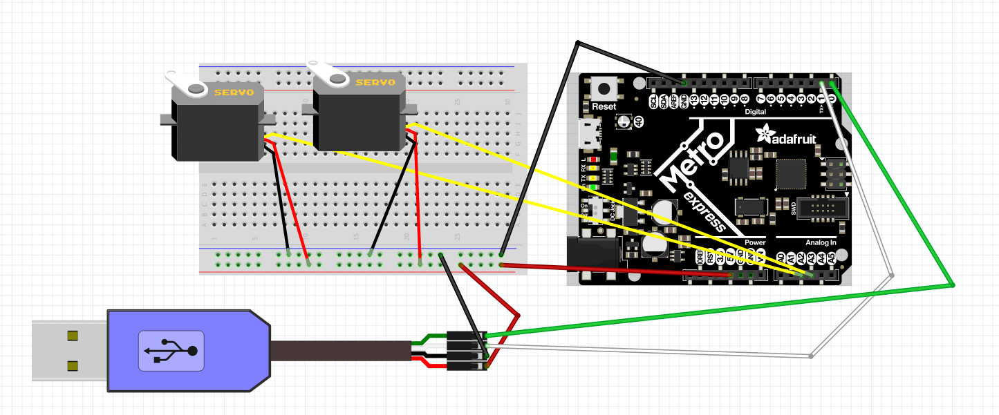

# Processing
All my processing assignments

## Hello Processing
### Objective
Use the Processing program to code a circle to bounce around the screen.
### Picture

### Lessons & Methods
In this assignment, I learned how to create and color a background and circle on Processsing by using the size (), background (), ellipse (), and fill () functions.  Additionally, I coded the circle to bounce by increasing the vertical and horizontal components at different rates, and making them switch directions when they hit the sides of the screen.

## CircuitPython to Processing
### Objective
Use a UART cable to send the values of a potentiometer to Processing, and use them to draw a speedometer.
### Picture 

### Wiring

### Lessons & Methods
In this assignment, I learned how to send data in bytes across a UART cable and convert that to an integer when in Processing.  In order to get the speedometer to accurately move, I mapped the potentiometer value to an angle (in radians) and then use the rotate () function to rotate the circle (and the line I had drawn in the circle) by that angle.  Additionally, I drew the line slightly below the center of the circle, in order to make it look more like a real speedometer.  I also mapped the angle to different color values based on the position of the line. 

## Processing to CircuitPython
### Objective
Use a UART cable to send values from Processing to CircuitPython and create a program that reads the x and y position of a mouse and uses this to set the position of two servos.
### Picture

### Wiring

### Lessons & Methods
In this assignment, I created a visually pleasing screen so that the user can see their mouse position and resulting servo angles, and then converted these mouse values into a string to be sent over UART. It was important to add 0s to the hundreds and tens place if there wasn't already a digit there, so that the CircuitPython program knew what value was in what place.  I separated the two angle value in the string with a comma and a dollar sign, and then multiplied the first integer by 100, the second by 10, and the third by 1, and then added them together in order to reform the string into an angle to be sent to the servos.
