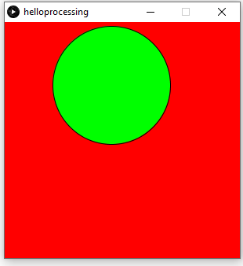
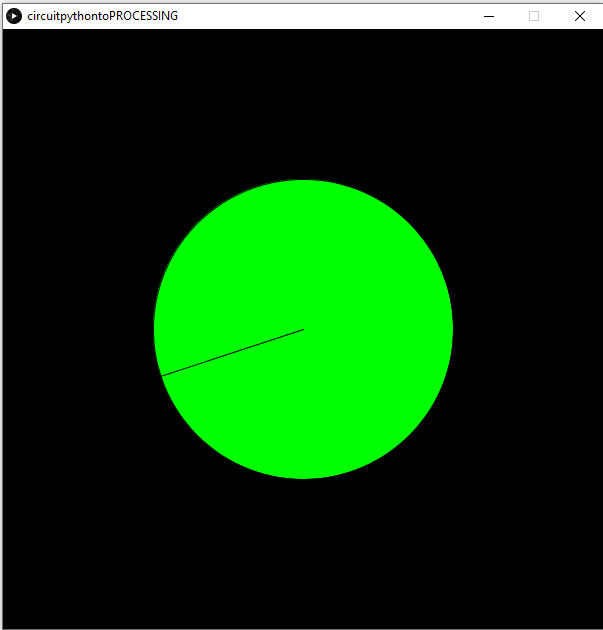
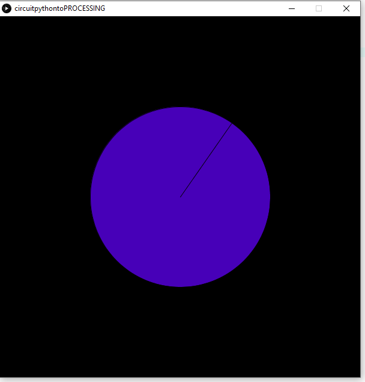
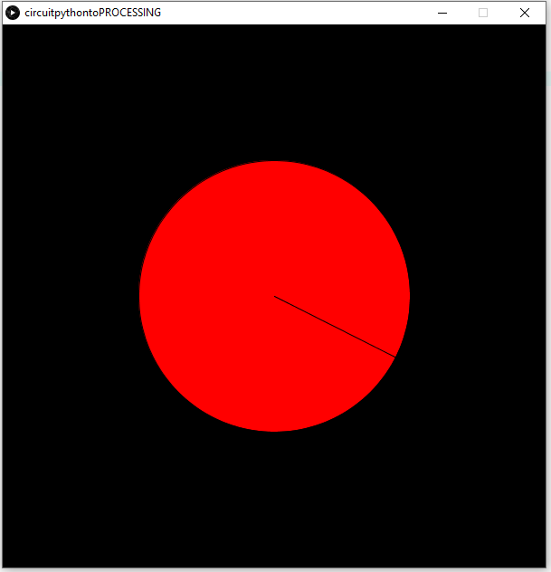

# Processing
All my processing assignments

## Hello Processing
### Objective
Use the Processing program to code a circle to bounce around the screen.
### Picture

### Lessons & Methods
In this assignment, I learned how to create and color a background and circle on Processsing by using the size (), background (), ellipse (), and fill () functions.  Additionally, I coded the circle to bounce by increasing the vertical and horizontal components at different rates, and making them switch directions when they hit the sides of the screen.

## CircuitPython to Processing
### Objective
Use a UART cable to send the values of a potentiometer to Processing, and use them to draw a speedometer
### Picture 

### Lessons & Methods
In this assignment, I learned how to send data in bytes across a UART cable and convert that to an integer when in Processing.  In order to get the speedometer to accurately move, I mapped the potentiometer value to an angle (in radians) and then use the rotate () function to rotate the circle (and the line I had drawn in the circle) by that angle.  Additionally, I drew the line slightly below the center of the circle, in order to make it look more like a real speedometer.  I also mapped the angle to different color values based on the position of the line. 
