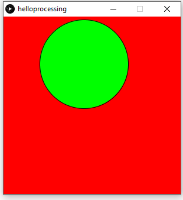

# Processing
All my processing assignments

## Hello Processing
### Objective
Use the Processing program to code a circle to bounce around the screen.
### Picture

### Lessons & Methods
In this assignment, I learned how to create and color a background and circle on Processsing by using the size (), background (), ellipse (), and fill () functions.  Additionally, I coded the circle to bounce by increasing the vertical and horizontal components at different rates, and making them switch directions when they hit the sides of the screen.
